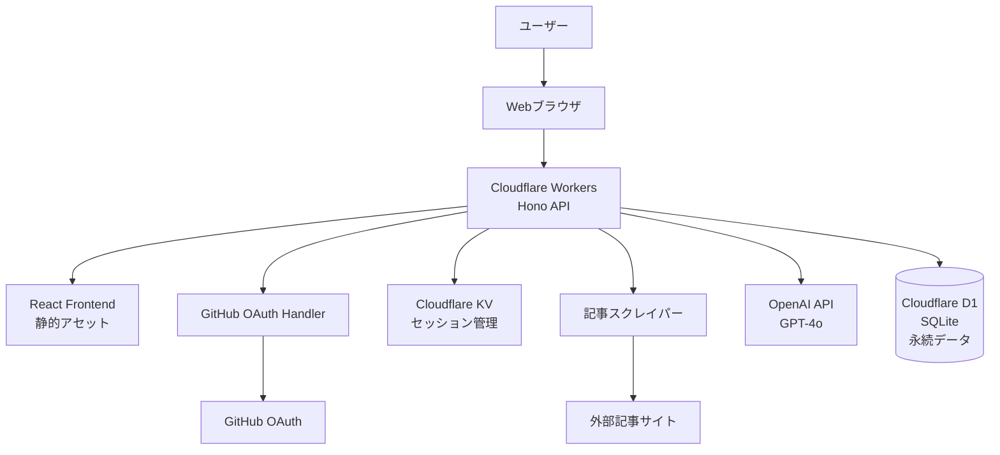

# 設計書

## 概要

本システムは、英語学習を支援するWebアプリケーションである。ユーザーが提供した英語記事のURLから、AI（LLM）を活用して学習コンテンツ（日本語要約、高校レベル以上の英単語訳、理解度確認用Q&A）を自動生成する。生成されたコンテンツはUUIDで識別され、認証されたユーザー間で共有可能である。

### 技術スタック

- **ランタイム**: Cloudflare Workers (エッジコンピューティング)
- **フロントエンド**: React, TypeScript
- **UIコンポーネント**: Chakra UI v2
- **状態管理・データフェッチ**: TanStack Query (React Query)
- **バックエンド**: Hono (Cloudflare Workers対応)
- **認証**: GitHub OAuth (カスタム実装)
- **データベース**: Cloudflare D1 (SQLite互換)
- **KVストア**: Cloudflare KV (セッション管理用)
- **ORM**: Drizzle ORM (Cloudflare D1対応)
- **AI/LLM**: OpenAI API (GPT-4o または GPT-4o-mini)
- **Webスクレイピング**: Cloudflare Workers互換のHTTPクライアント
- **ビルド**: Wrangler (Cloudflare Workers CLI)
- **デプロイ**: Cloudflare Workers

## アーキテクチャ

### システム構成図



### レイヤー構造

1. **プレゼンテーション層**: React コンポーネント（Chakra UI使用）
2. **エッジルーティング層**: Hono フレームワーク（Cloudflare Workers上で動作）
3. **ビジネスロジック層**: サービスクラス（TypeScript）
4. **データアクセス層**: Drizzle ORM（Cloudflare D1対応）
5. **外部サービス層**: OpenAI API、記事スクレイピング

### 技術選定の利点

#### Cloudflare Workersの利点
- **グローバルエッジネットワーク**: 世界中で低レイテンシー
- **自動スケーリング**: トラフィックに応じて自動的にスケール
- **コールドスタート不要**: 常時起動状態
- **コスト効率**: 無料枠が充実（1日10万リクエスト）
- **統合エコシステム**: D1、KV、R2などのサービスとシームレス連携

#### Honoの利点
- **軽量**: Cloudflare Workers向けに最適化
- **高速**: ルーティングが非常に高速
- **TypeScript完全サポート**: 型安全なAPI開発
- **マルチランタイム対応**: Workers、Bun、Node.jsで動作

#### Chakra UIの利点
- **アクセシビリティ**: WAI-ARIA準拠のコンポーネント
- **テーマカスタマイズ**: 柔軟なデザインシステム
- **TypeScript完全サポート**: 型安全なコンポーネント
- **レスポンシブ対応**: モバイルファーストのデザイン
- **ダークモード**: 組み込みのカラーモード切り替え

#### TanStack Queryの利点
- **自動キャッシング**: APIレスポンスを自動的にキャッシュ
- **バックグラウンド更新**: データの自動再取得
- **楽観的更新**: UIの即座な更新とロールバック
- **ローディング・エラー状態管理**: 宣言的な状態管理
- **リクエストの重複排除**: 同じクエリの重複リクエストを防止
- **TypeScript完全サポート**: 型安全なAPI呼び出し

#### Cloudflare D1の利点
- **SQLite互換**: 標準的なSQL構文
- **エッジ配置**: データをユーザーに近い場所に配置
- **自動レプリケーション**: グローバルに複製
- **低コスト**: 無料枠が充実（500万行読み取り/月）
- **トランザクションサポート**: ACID特性を保証
- **柔軟なクエリ**: SQLによる複雑なクエリが可能

#### Cloudflare KVの利点
- **TTLネイティブサポート**: セッション期限切れの自動処理
- **超高速読み取り**: キー/バリューストアとして最適化
- **グローバル分散**: 世界中のエッジで利用可能
- **低コスト**: 無料枠が充実（100,000読み取り/日、1,000書き込み/日）
- **シンプルAPI**: セッション管理に最適

## コンポーネントとインターフェース

### 主要コンポーネント

#### 1. 認証コンポーネント (AuthComponent)

**責務**: ユーザー認証とセッション管理

**インターフェース**:
```typescript
interface AuthService {
  // GitHub OAuth認証を開始
  signInWithGitHub(): Promise<void>;
  
  // ログアウト
  signOut(): Promise<void>;
  
  // 現在のセッションを取得
  getSession(): Promise<Session | null>;
  
  // 認証状態を確認
  isAuthenticated(): Promise<boolean>;
}
```

#### 2. 記事取得コンポーネント (ArticleFetcher)

**責務**: 外部URLから記事コンテンツを取得

**インターフェース**:
```typescript
interface ArticleFetcher {
  // URLから記事を取得
  fetchArticle(url: string): Promise<ArticleContent>;
  
  // URLの妥当性を検証
  validateUrl(url: string): boolean;
}

interface ArticleContent {
  title: string;
  content: string;
  url: string;
  fetchedAt: Date;
}
```

#### 3. コンテンツ生成コンポーネント (ContentGenerator)

**責務**: OpenAI APIを使用して学習コンテンツを生成

**インターフェース**:
```typescript
interface ContentGenerator {
  // 日本語要約を生成（OpenAI GPT-4o使用）
  generateSummary(article: ArticleContent): Promise<string>;
  
  // 高校レベル以上の英単語を抽出し日本語訳を生成（OpenAI GPT-4o使用）
  extractVocabulary(article: ArticleContent): Promise<VocabularyItem[]>;
  
  // 理解度確認用Q&Aを生成（OpenAI GPT-4o使用）
  generateQuestions(article: ArticleContent): Promise<Question[]>;
  
  // OpenAI APIを使用してユーザーの回答を動的に評価
  // 記述式回答も含め、文脈を理解した柔軟な判定を行う
  evaluateAnswer(
    question: Question, 
    userAnswer: string, 
    articleContext: string
  ): Promise<AnswerEvaluation>;
}

interface AnswerEvaluation {
  isCorrect: boolean; // 正解/不正解の判定
  feedback: string; // LLMが生成する詳細なフィードバック
  score?: number; // 0-100のスコア（部分点対応）
  reasoning?: string; // 判定理由の説明
}

interface VocabularyItem {
  word: string;
  translation: string;
  difficulty: string; // CEFR レベル
  context?: string; // 記事内での使用例
}

interface Question {
  id: string;
  question: string;
  options?: string[]; // 選択肢（記述式の場合はオプション）
  correctAnswer: string;
  explanation: string;
  type: 'multiple-choice' | 'free-text'; // 質問タイプ
}
```

#### 4. コンテンツ管理コンポーネント (ContentManager)

**責務**: 生成されたコンテンツの保存と取得

**インターフェース**:
```typescript
interface ContentManager {
  // コンテンツを保存
  saveContent(content: LearningContent): Promise<string>; // UUID を返す
  
  // UUIDでコンテンツを取得
  getContentById(uuid: string): Promise<LearningContent | null>;
  
  // ユーザーのコンテンツ一覧を取得
  getUserContents(userId: string): Promise<LearningContent[]>;
}

interface LearningContent {
  id: string; // UUID
  userId: string;
  articleUrl: string;
  articleTitle: string;
  summary: string;
  vocabulary: VocabularyItem[];
  questions: Question[];
  createdAt: Date;
}
```

## データモデル

### データベーススキーマ

```prisma
```typescript
// Drizzle ORM スキーマ定義（Cloudflare D1用）
import { sqliteTable, text, integer, index } from 'drizzle-orm/sqlite-core';

export const users = sqliteTable('users', {
  id: text('id').primaryKey(), // UUID文字列
  githubId: text('github_id').notNull().unique(),
  name: text('name'),
  email: text('email').unique(),
  image: text('image'),
  createdAt: integer('created_at', { mode: 'timestamp' }).notNull(),
  updatedAt: integer('updated_at', { mode: 'timestamp' }).notNull(),
});

export const contents = sqliteTable('contents', {
  id: text('id').primaryKey(), // UUID文字列
  userId: text('user_id').notNull().references(() => users.id, { onDelete: 'cascade' }),
  articleUrl: text('article_url').notNull(),
  articleTitle: text('article_title').notNull(),
  summary: text('summary').notNull(),
  vocabulary: text('vocabulary').notNull(), // JSON文字列: VocabularyItem[]
  questions: text('questions').notNull(), // JSON文字列: Question[]
  createdAt: integer('created_at', { mode: 'timestamp' }).notNull(),
  updatedAt: integer('updated_at', { mode: 'timestamp' }).notNull(),
}, (table) => ({
  userIdIdx: index('user_id_idx').on(table.userId),
  createdAtIdx: index('created_at_idx').on(table.createdAt),
}));


```
```

## 正確性プロパティ

*プロパティとは、システムのすべての有効な実行において真であるべき特性や動作のことである。プロパティは、人間が読める仕様と機械で検証可能な正確性保証の橋渡しとなる。*


### プロパティ反映

事前分析の結果、以下のプロパティの統合を行う：
- プロパティ2（コンテンツ表示）: 2.1と2.2を統合し、すべての必須要素の表示を一つのプロパティで検証
- プロパティ5（エラーハンドリング）: 5.1と5.2を統合し、無効入力に対するエラー処理を包括的に検証
- プロパティ9（Q&A生成）: 7.1と7.2を統合し、Q&A生成の完全性を一つのプロパティで検証

### 正確性プロパティ一覧

**プロパティ1: 記事取得の成功**
*任意の*有効なURLに対して、記事取得関数を呼び出すと、記事コンテンツ（タイトル、本文、URL）が返されること
**検証対象: 要件 1.1**

**プロパティ2: コンテンツ表示の完全性**
*任意の*学習コンテンツに対して、レンダリングされたページには日本語要約、英単語訳、Q&A、元記事URLのすべてが含まれること
**検証対象: 要件 2.1, 2.2**

**プロパティ3: 日本語要約の生成**
*任意の*記事コンテンツに対して、要約生成関数を呼び出すと、空でない日本語の要約文字列が返されること
**検証対象: 要件 1.2**

**プロパティ4: 高校レベル以上の英単語抽出**
*任意の*記事コンテンツに対して、単語抽出関数が返すすべての単語は、CEFR B1レベル以上であること
**検証対象: 要件 1.3, 6.1**

**プロパティ5: エラー入力の拒否**
*任意の*無効なURL形式または取得不可能なURLに対して、システムは適切なエラーメッセージを返し、処理を中断すること
**検証対象: 要件 5.1, 5.2**

**プロパティ6: UUID一意性**
*任意の*複数のコンテンツ生成において、割り当てられるすべてのUUIDは互いに異なること
**検証対象: 要件 3.1**

**プロパティ7: コンテンツ保存と取得のラウンドトリップ**
*任意の*学習コンテンツに対して、保存後にそのUUIDで取得したコンテンツは、元のコンテンツと等しいこと
**検証対象: 要件 3.2**

**プロパティ8: 存在しないUUIDのエラー処理**
*任意の*データベースに存在しないUUIDに対して、取得関数はnullまたはエラーを返すこと
**検証対象: 要件 3.3**

**プロパティ9: Q&A生成の完全性**
*任意の*記事コンテンツに対して、Q&A生成関数は3〜5個の質問を返し、各質問には質問文、選択肢、正解、解説が含まれること
**検証対象: 要件 7.1, 7.2**

**プロパティ10: 単語リストのソート順**
*任意の*英単語リストに対して、表示される単語は出現順または難易度順のいずれかで正しくソートされていること
**検証対象: 要件 6.4**

**プロパティ11: 認証済みユーザーのみのアクセス**
*任意の*コンテンツページに対して、未認証状態でアクセスした場合、システムはアクセスを拒否しログイン画面にリダイレクトすること
**検証対象: 要件 3.4, 4.1**

**プロパティ12: セッション有効性の維持**
*任意の*有効なセッションを持つユーザーに対して、システムは再認証を要求せずにコンテンツへのアクセスを許可すること
**検証対象: 要件 4.6**

**プロパティ13: トランザクション整合性**
*任意の*コンテンツ生成処理において、エラーが発生した場合、部分的に生成されたデータはデータベースに保存されないこと
**検証対象: 要件 5.4**

**プロパティ14: OpenAI APIによる動的回答評価**
*任意の*質問、回答、記事コンテキストの組み合わせに対して、OpenAI API評価関数は正誤判定（isCorrect）、詳細なフィードバック（feedback）、判定理由（reasoning）を含む評価結果を返すこと。記述式回答も文脈を理解して柔軟に判定すること
**検証対象: 要件 7.3**

## エラーハンドリング

### エラーの種類と対応

#### 1. 入力検証エラー
- **無効なURL形式**: クライアント側で即座に検証し、エラーメッセージを表示
- **空の入力**: フォーム送信を無効化

#### 2. 記事取得エラー
- **404 Not Found**: 「記事が見つかりませんでした」
- **403 Forbidden**: 「アクセスが拒否されました」
- **タイムアウト**: 「記事の取得に時間がかかりすぎています。再試行してください」
- **ネットワークエラー**: 「ネットワーク接続を確認してください」

#### 3. コンテンツ生成エラー
- **OpenAI APIエラー**: 「コンテンツの生成に失敗しました。しばらくしてから再試行してください」
- **レート制限**: 「リクエストが多すぎます。しばらく待ってから再試行してください」
- **モデル呼び出しエラー**: 「GPT-4oモデルの呼び出しに失敗しました」
- **トークン制限超過**: 「記事が長すぎます。より短い記事を選択してください」

#### 4. 認証エラー
- **GitHub OAuth失敗**: 「GitHub認証に失敗しました。再度お試しください」
- **セッション期限切れ**: 自動的にログイン画面にリダイレクト

#### 5. データベースエラー
- **保存失敗**: トランザクションをロールバックし、エラーメッセージを表示
- **UUID衝突**: 新しいUUIDを生成して再試行（極めて稀）

### エラーログ

すべてのエラーはサーバーサイドでログに記録し、デバッグと監視に使用する。

## テスト戦略

### ユニットテスト

以下のコンポーネントに対してユニットテストを実施：

1. **URL検証関数**: 有効/無効なURL形式のテスト
2. **記事パーサー**: HTMLからテキスト抽出のテスト
3. **単語難易度判定**: CEFR レベル判定のテスト
4. **UUID生成**: 形式の妥当性テスト
5. **認証ヘルパー**: セッション検証のテスト

### プロパティベーステスト（Property-Based Testing）

**使用ライブラリ**: fast-check (TypeScript/JavaScript用PBTライブラリ)

**設定**: 各プロパティテストは最低100回の反復実行を行う

**実装要件**:
- 各プロパティベーステストには、対応する正確性プロパティを明示的にコメントで記載する
- コメント形式: `// Feature: english-learning-app, Property X: [プロパティ名]`
- 各正確性プロパティは、1つのプロパティベーステストで実装する

**テスト対象プロパティ**:
1. プロパティ1: 記事取得の成功
2. プロパティ2: コンテンツ表示の完全性
3. プロパティ3: 日本語要約の生成
4. プロパティ4: 高校レベル以上の英単語抽出
5. プロパティ5: エラー入力の拒否
6. プロパティ6: UUID一意性
7. プロパティ7: コンテンツ保存と取得のラウンドトリップ
8. プロパティ8: 存在しないUUIDのエラー処理
9. プロパティ9: Q&A生成の完全性
10. プロパティ10: 単語リストのソート順
11. プロパティ11: 認証済みユーザーのみのアクセス
12. プロパティ12: セッション有効性の維持
13. プロパティ13: トランザクション整合性
14. プロパティ14: 回答の正誤判定

### 統合テスト

以下のフローに対して統合テストを実施：

1. **エンドツーエンドコンテンツ生成**: URL入力から表示までの完全なフロー
2. **認証フロー**: GitHub OAuth認証からログアウトまで
3. **コンテンツ共有**: UUID URLでのアクセスと表示

### E2Eテスト

**使用ツール**: Playwright

主要なユーザーシナリオをブラウザで自動テスト：
1. ログイン → URL入力 → コンテンツ生成 → 表示確認
2. コンテンツ共有URLへのアクセス
3. ログアウト

## セキュリティ考慮事項

### 認証とセッション管理
- GitHub OAuthフローのカスタム実装（Honoミドルウェア）
- Cloudflare KVを使用したセッション管理
- セッションIDをHTTPOnly Cookieで保護
- KVのTTL機能で自動的にセッション期限切れを処理
- CSRF保護を実装
- セッションデータ構造: `{ userId, createdAt, expiresAt }`

### データ保護
- ユーザーのコンテンツは作成者のみがアクセス可能（共有URLを除く）
- データベース接続は環境変数で管理
- OpenAI APIキーはWrangler Secretsで管理し、クライアントに露出しない
- 環境変数の適切な管理（開発/本番環境の分離）

### 入力検証
- すべてのユーザー入力をサーバーサイドで検証
- SQLインジェクション対策（Prisma ORMが自動的に対応）
- XSS対策（Reactが自動的にエスケープ）

### レート制限
- Cloudflare Workers Rate Limitingを実装し、悪用を防止
- Cloudflare KVを使用したカスタムレート制限（リクエストカウンター）
- OpenAI APIの使用量を監視（OpenAI Dashboard）
- Cloudflare Analyticsでトラフィック監視
- コスト管理のためのアラート設定
- ユーザーごとのAPI呼び出し制限（KVで管理、TTL付き）

## パフォーマンス最適化

### フロントエンド
- TanStack Queryでサーバー状態を管理
- 自動キャッシングとバックグラウンド更新
- Reactのサスペンス機能を活用
- コンテンツ生成中はローディング状態を表示（TanStack Queryの状態管理）
- Cloudflare Workersから静的アセットを配信
- Cloudflare CDNによる高速配信
- 楽観的更新でUXを向上

### バックエンド
- Cloudflare Workersのエッジコンピューティングを活用
- データベースクエリの最適化（適切なインデックス）
- OpenAI APIレスポンスのストリーミング（GPT-4oのストリーミング機能を活用）
- 生成済みコンテンツのキャッシュ（Cache APIまたはKV）
- OpenAI SDK for JavaScriptの効率的な使用（Workers環境で動作）
- Honoの軽量ミドルウェアによる高速レスポンス
- Workers実行時間制限（CPU時間）の考慮
- 長時間実行タスクはDurable Objectsの活用を検討
- D1のトランザクション機能を活用したデータ整合性の保証
- KVの高速読み取りでセッション検証を最適化

### デプロイ
- Wrangler CLIを使用してCloudflare Workersにデプロイ
- GitHub Actionsによる自動デプロイ（CI/CD）
- 環境変数の管理（Wrangler Secrets）
- カスタムドメインの設定
- Cloudflare CDNによる自動的なグローバル配信
- ステージング環境とプロダクション環境の分離
- ロールバック機能（Wranglerのバージョン管理）

## 今後の拡張可能性

### フェーズ2以降の機能候補
1. **学習履歴の追跡**: ユーザーの学習進捗を記録
2. **お気に入り機能**: コンテンツをブックマーク
3. **単語帳機能**: 学習した単語を復習
4. **難易度フィルター**: 記事の難易度を事前に判定
5. **複数言語対応**: 英語以外の言語学習にも対応
6. **音声読み上げ**: 記事や単語の発音を聞く
7. **コミュニティ機能**: ユーザー間でコンテンツを共有・評価
